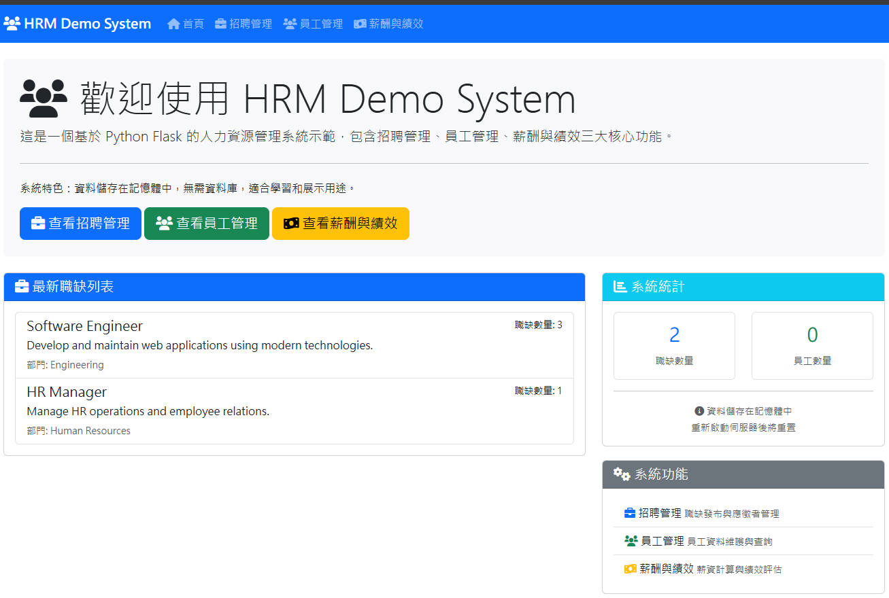

# VibeCodingHRM
Vibe Coding HRM



---

1. 專案架構設定
- Flask 應用程式結構
- 模板與靜態檔案組織
- 依賴套件設定
2. 基礎模板與導航
- 響應式 Bootstrap UI 設計
- 完整的模組間導航
- Font Awesome 圖標整合
3. 首頁
- 系統概覽與職缺展示
- 統計數據面板
- 快速導航按鈕
4. 招聘管理
- 職缺列表（可展開式設計）
- 新增/編輯/刪除職缺
- 應徵者申請模擬
- 應徵者資料追蹤
5. 員工管理
- 員工 CRUD 操作
- 姓名與部門搜尋篩選
- 部門統計分析
- 完整的員工資料管理
6. 薪酬與績效管理
- 薪資資料管理（基礎薪資、獎金、扣款）
- 即時實支薪資計算
- 績效評等系統
- 薪酬統計與分析
# 🚀 如何執行系統
1. 安裝依賴套件：
```bash
pip install -r requirements.txt
```
2. 啟動系統：
```bash
python app.py
```
3. 訪問系統： 開啟瀏覽器訪問 http://localhost:5000
- 📋 系統特色
- 🎨 現代化 UI：使用 Bootstrap 5 響應式設計
- 📊 即時分析：部門統計、薪酬計算、績效分布
- ⚡ 輕量級架構：無資料庫依賴，記憶體儲存
- 🔄 完整 CRUD：所有模組的建立、讀取、更新、刪除功能
- 🔍 搜尋篩選：員工姓名與部門篩選
- 💰 智慧計算：自動計算實支薪資與統計數據
# 📁 專案檔案結構
```bash
VibeCodingHRM/
├── app.py                 # 主應用程式
├── requirements.txt       # Python 依賴
├── PRD.md                 # 產品需求文件
├── templates/             # HTML 模板檔案
│   ├── base.html         # 基礎模板
│   ├── index.html        # 首頁
│   ├── recruitment.html  # 招聘管理
│   ├── employees.html    # 員工管理
│   ├── compensation.html # 薪酬與績效
│   └── ...               # 其他表單模板
└── static/               # 靜態檔案
```